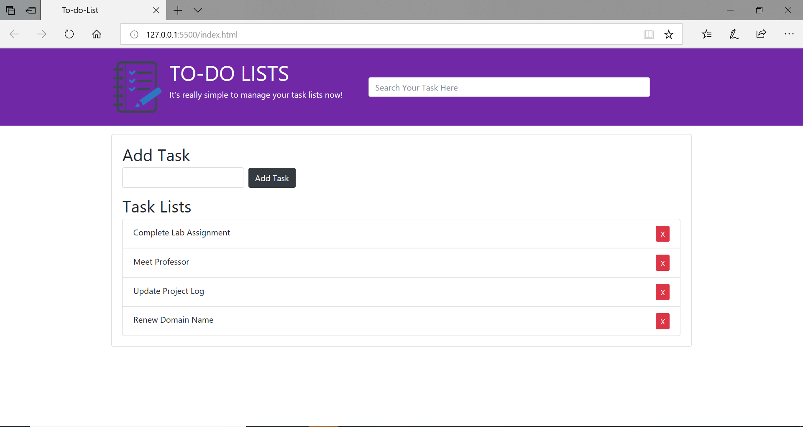

# To-do List App 

> A Simple To-do List web page to view, add, search and delete task.

## Table of contents
* [Technologies](#technologies)
* [Running the Application](#running-the-application)
* [snapshot](#snapshots)
* [Contact](#contact)

## Technologies
* Technologies - JavaScript, HTML5, CSS3

## Running the Application
* Step 1: Open the index.html in any browser and the browser automatically interprets coding and displays it. 
( In Visual Studio Code Editor,you can run the index.html file with Live Sever.)

## snapshots
 

## Contact
[Hemanth Kumar Woraram](https://hemanthkumarw.com/) - feel free to contact me!
